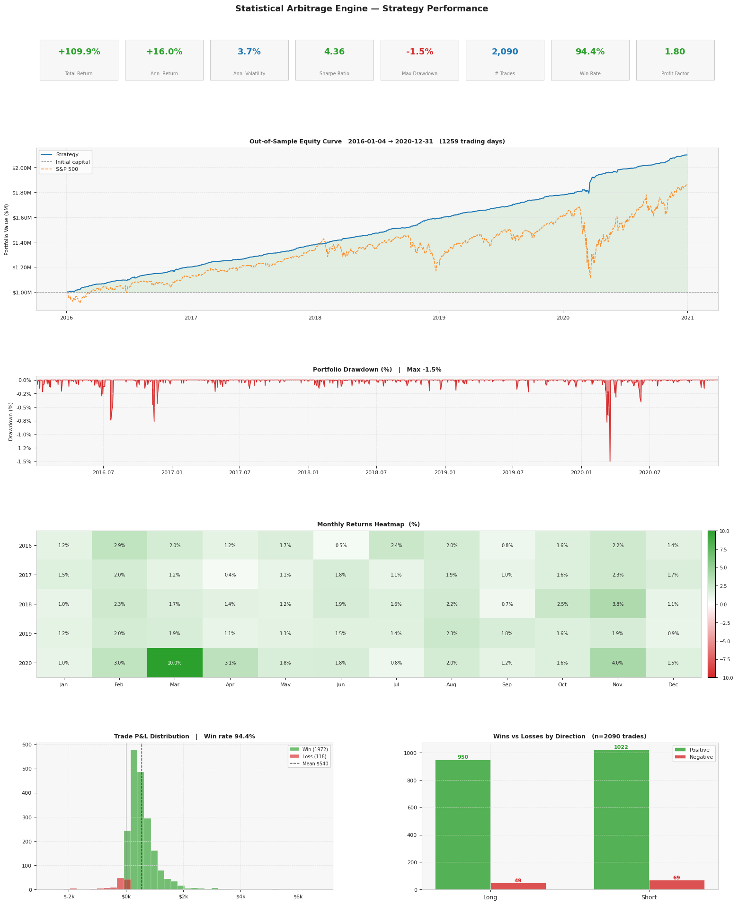

# Statistical Arbitrage Engine

A pairs trading strategy built on cointegration testing, the Ornstein-Uhlenbeck mean reversion model, and a Kalman filter for dynamic hedge ratio estimation. The strategy runs a rolling walk-forward backtest on S&P 500 stocks, screens pairs monthly, and only trades out-of-sample.

---

## What it does

1. Pulls price history for S&P 500 stocks (via yfinance)
2. Screens for cointegrated pairs within the same GICS sector
3. Fits an OU mean reversion model to each pair's spread
4. Trades the spread using a Kalman filter hedge ratio and rolling z-score signals
5. Runs a walk-forward backtest with no lookahead, monthly pair re-screening, and continuous position carry-over across windows

---

## Notebooks

| Notebook | What it does |
|---|---|
| `data_setup.ipynb` | Downloads prices, cleans data, builds cache |
| `modelling_part1.ipynb` | Pair screening pipeline |
| `modelling_part2.ipynb` | OU model fit + Kalman filter |
| `strategy_and_backtest.ipynb` | Walk-forward backtest + performance |

Run them in order. Each one saves to `cache/` and the next one reads from there.

---

## Models and Tests

### Pair Screening

**Engle-Granger cointegration test**
Runs OLS regression in both directions (Y vs X and X vs Y), then checks if the residuals are stationary using the ADF test. A pair passes if either direction gives a p-value below 5%. Requires at least 252 days of shared price history.

**Johansen cointegration test**
A VAR-based test that uses the trace statistic against the 95% critical value. More powerful than Engle-Granger because it tests both series symmetrically. Only pairs that pass both EG and Johansen move forward.

**OU half-life filter**
Fits the regression dS = a + b * S_{t-1} to the spread, then computes half-life = -ln(2) / b. This measures how quickly the spread reverts to its mean. Pairs with a half-life between 5 and 100 trading days are kept. Too short means noise, too long means you wait forever for it to close.

**Additional filters**
Same GICS industry (Level 3), price correlation above 0.70.

The screening funnel: 3,087 candidate pairs within sectors, 2,787 pass EG, 677 pass Johansen, 206 pass the half-life filter, 26 pass the industry filter.

---

### Spread Model

**Ornstein-Uhlenbeck MLE**
Fits the OU process dS = k(u - S)dt + s*dW to each pair's spread using maximum likelihood. The parameters k (mean reversion speed), u (long-run mean), and s (volatility) are estimated using the exact Gaussian transition density via L-BFGS-B optimization.

**Kalman Filter hedge ratio**
Instead of a fixed OLS hedge ratio, a Kalman filter is used to let the hedge ratio evolve over time. The state space is:

```
Observation : Y_t = beta_t * X_t + alpha_t + noise
State       : [beta_t, alpha_t] follow a random walk
```

The forgetting factor delta = 1e-4 controls how fast the hedge ratio adapts. A 500-day warmup period is used before any signal is generated. In testing, 100% of pairs showed more stationary spreads under Kalman vs static OLS.

---

### Signal Generation

- Spread z-score computed over a 63-day rolling window
- Entry when |z| > 2.0 (long spread if z < -2, short if z > +2)
- Exit when |z| < 0.5
- Stop loss at |z| > 3.0

---

### Walk-Forward Backtest

- 6-month out-of-sample windows, cumulative training data (no fixed lookback)
- Pairs are re-screened monthly and cached to disk (1000 trading days of history per screen)
- Positions carry over across windows without force-closing at boundaries
- Pairs that fail re-screening but have an open position are allowed to run to close, with no new entries
- Capital is split equally across all active pairs per window
- Transaction costs: 5 bps per side on every position change
- Drawdown circuit breaker: scales position sizing down if portfolio drawdown exceeds -10%

---

## Performance

All results are out-of-sample. Starting capital $1,000,000.

| Period | Total Return | Ann. Return | Ann. Vol | Sharpe | Max DD | Trades | Win Rate | Profit Factor |
|---|---|---|---|---|---|---|---|---|
| 2013-2016 | +45.6% | +13.4% | 1.4% | 9.82 | -0.9% | 2,019 | 95.5% | 1.00 |
| 2016-2021 | +109.9% | +16.0% | 3.7% | 6.36 | -1.5% | 2,090 | 94.4% | 1.80 |
| 2021-2026 | +102.5% | +15.3% | 2.5% | 6.02 | -0.7% | 2,865 | 92.6% | 5.91 |
| **Full (2013-2026)** | **+268.4%** | **+10.2%** | **2.8%** | **3.61** | **-1.2%** | **7,306** | **93.6%** | **1.83** |

### 2016-2021 Dashboard



---

## How to Run

```bash
pip install -r requirements.txt
```

Run notebooks in order:

```
data_setup.ipynb          # downloads prices, ~5-10 min
modelling_part1.ipynb     # screens pairs, ~20-30 min first run (cached after)
modelling_part2.ipynb     # fits OU + Kalman
strategy_and_backtest.ipynb  # runs backtest + plots
```

The pair cache (`pair_cache/`) builds monthly files from the start date to today. On re-runs it skips months already on disk, so it is safe to interrupt and resume.

---

## Project Structure

```
.
+-- data_setup.ipynb              # data pipeline
+-- modelling_part1.ipynb         # pair screener
+-- modelling_part2.ipynb         # OU model + Kalman filter
+-- strategy_and_backtest.ipynb   # walk-forward backtest
+-- requirements.txt
+-- cache/                        # generated outputs (parquet + plots)
+-- pair_cache/                   # monthly pair screening cache
```

---

## Notes

- Universe: S&P 500 constituents only. The list is scraped from Wikipedia at run time, so it reflects the current index, not the historical one. Minor survivorship bias exists.
- The `price_corr` filter in pair screening uses full history, which is a small source of lookahead. The cointegration tests and OU fits are always trained up to the screening date only.
- Sharpe ratios above 6 are high and are partly a function of low realized volatility in this strategy's return profile, not leverage. The strategy is market-neutral by construction.
